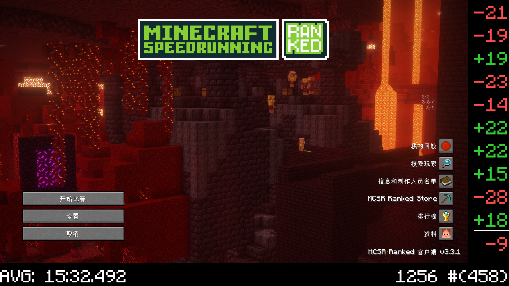

# BETTER-RANK

## 介绍
一种可行的rank直播美化方案

## 功能
   - 能实时显示你的本赛季平均完成时间，elo分，排名，自从上次登录后最近10把的比赛数据（以及汇总）
 
   - 借鉴了 Julti 的场景切换思想，能够实现 **inworld（在世界内）** 和 **title（不在世界内）** 两种模式的自动切换。
 
   - 附加一键启动脚本和自动开mag(如果需要)

## 用法
   参考视频 [bilibili链接][1] 或 [抖音链接][2]

## 示例

[1]: https://www.bilibili.com/video/BV18xxjenEgz/
[2]: https://www.douyin.com/video/7418984782693928219